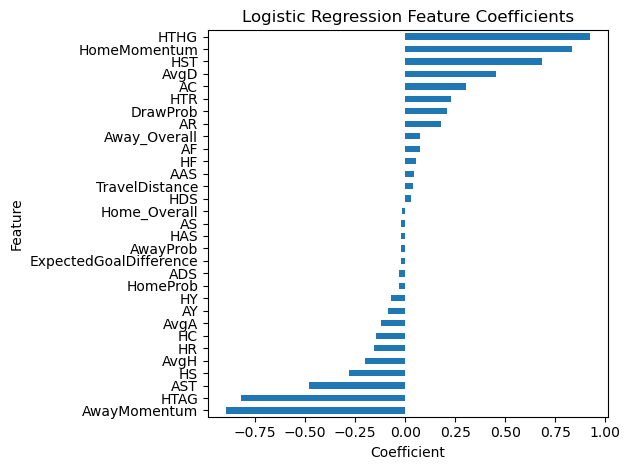
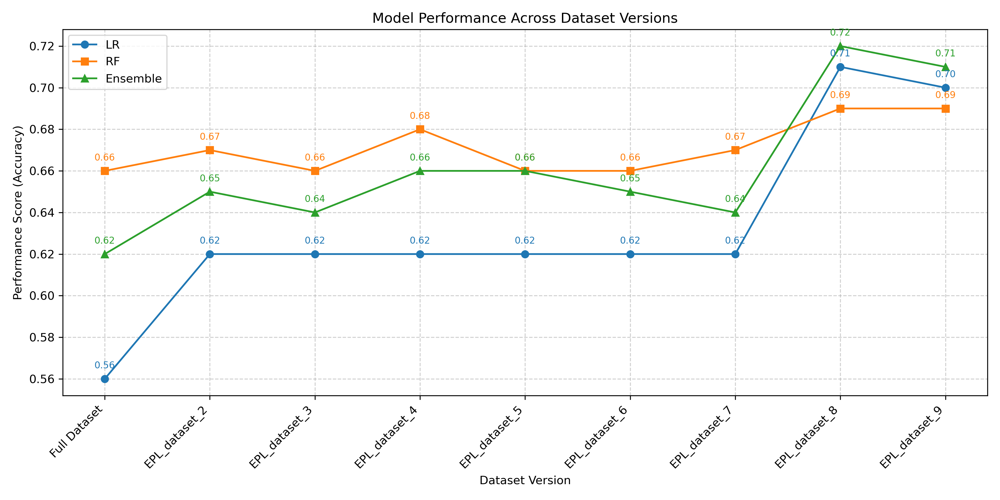
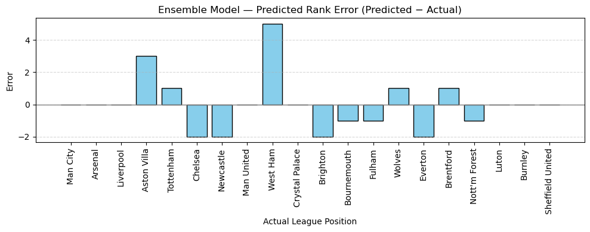
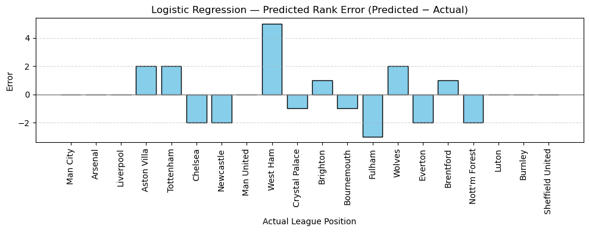
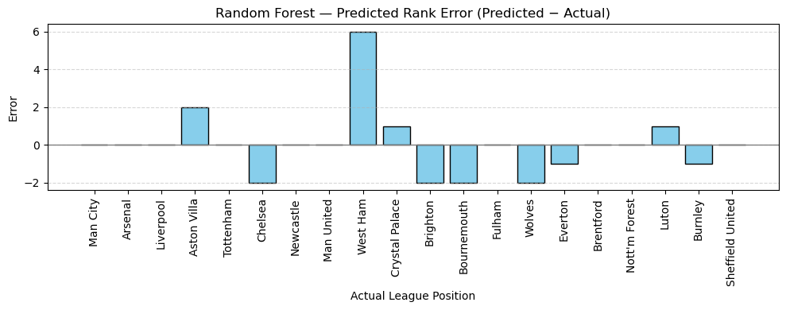
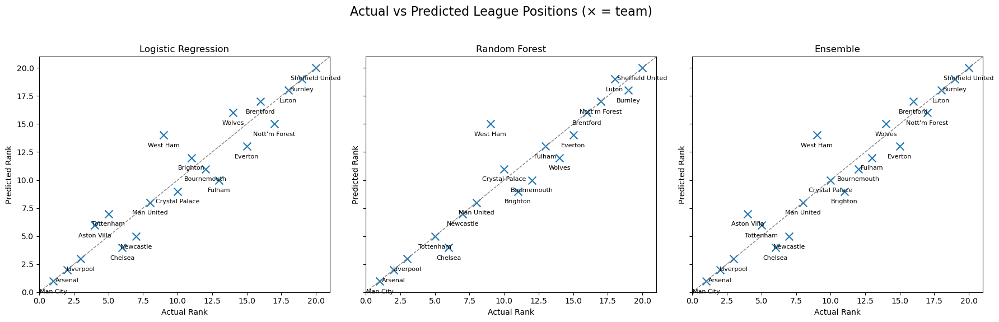

This repository contains the code, datasets, and models used in my undergraduate dissertation project:
**"Predicting Football League Match Outcomes and Final Standings Using Machine Learning and Contextual Feature Engineering"**
Academic Year: 2024–2025

---

## Project Structure

```
🔹 Feature Engineering/          # Scripts to engineer features like xG, momentum, etc.
🔹 Logistic Regression/          # Baseline logistic regression model
🔹 Random Forest/                # Baseline Random forest model
🔹 Ensemble Method/              # Final ensemble model combining RF and LR models
🔹 Results/                      # Model outputs, figures, and evaluation results
🔹 Tables/                       # Cleaned league tables and summary data
🔹 full_datasets_testing/       # Test notebooks on full datasets
🔹 datasets_versions/           # Different dataset versions over time
🔹 dataset_versioning.py        # Script for generating dated dataset versions
🔹 environment.yml              # Python environment definition (conda)
🔹 README.md
```

---

## 📁 Datasets

all datasets that were used in predictions are found in thr datasets_versions/ folder

---

## Models Used

* Logistic Regression
* Random Forest 
* Ensemble Model

Evaluation metrics include:

* Accuracy, Confusion Matrixes, and Precision Tables (for game to game level)
* RMSE, MAE and MSE (for table-level performances)

---

## Setup Instructions

1. Clone this repo:

```
git clone https://github.com/fbriebdk/liam_bugeja_BAN_dissertation_2025.git
cd liam_bugeja_BAN_dissertation_2025
```

2. Create the environment:

```
conda env create -f environment.yml
conda activate dissertation-env
```

3. Launch Jupyter notebooks:

```
jupyter notebook
```

---

## Visual Outputs

### Feature Importance (Logistic Regression)


### Feature Importance (Random Forest)


### Model Performance Chart


### MSE Charts
#### Ensemble Model


#### Logistic Regression


#### Random Forest


### 📈 Combined MSE Overview


---

## 👨‍🎓 Author

**Liam Bugeja**
Undergraduate Dissertation – Malta College of Arts, Science and Technology
Academic Supervisor: \[Mr. Luke Vella Critien]

---

## License

This project is licensed for academic use only. For reuse, please contact the author.
